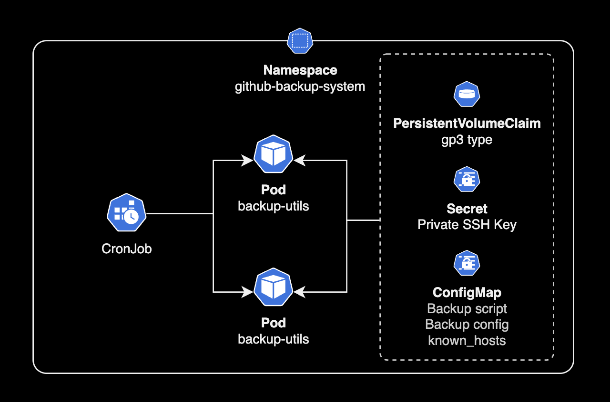

# backup-utils-chart

[](https://github.com/younsl/backup-utils-chart/blob/main/LICENSE)
[](https://github.com/younsl/backup-utils-chart/issues)

## Summary

CronJob 기반의 Github Enterprise 백업 서버 헬름 차트.

> Note:  
> backup-utils-chart is tested only in EKS `v1.26` ~ `v1.27` based on `linux/amd64`.

This helm chart is inspired by [mail2sandeppd/github-backup-utils-kubernetes](https://github.com/mail2sandeepd/github-backup-utils-kubernetes).

&nbsp;

## Architecture

All components of backup-utils run on k8s native resources.




&nbsp;

## Installation

### Generate SSH Key

Generate an Ed25519 type SSH key pair.

```bash
ssh-keygen \
    -t ed25519 \
    -C "backup@github.example.com" \
    -P ""
```

When you execute this command, the `ssh-keygen` utility will generate two key files in the current user's home directory:

```bash
$ ls -lh ~/.ssh/
total 16
-rw-------@ 1 doge  staff   411B  6 29 07:28 id_ed25519
-rw-r--r--@ 1 doge  staff    96B  6 29 07:28 id_ed25519.pub
```

- `id_ed25519`: This is the private key file and should be kept secure on your local machine. Inject the `id_ed25519` private key from the Secret into a pod controlled by CronJob.
- `id_ed25519.pub`: This is the public key file, and its contents are meant to be copied and added to the authorized_keys file on the remote github enterprise servers you want to access using this key.

Add the `id_ed25519.pub` key generated into the Github Enterprise server's Management Console.

For more detailed information, please refer to [the official documentation of Github Enterprise](https://docs.github.com/en/enterprise-server@3.9/admin/administering-your-instance/accessing-the-administrative-shell-ssh).

&nbsp;

### Push image to container registry

Build the backup-utils docker image using [official dockerfile](https://github.com/github/backup-utils/blob/v3.9.1/Dockerfile) on your local machine.

```bash
git clone https://github.com/github/backup-utils
cd backup-utils
```

```bash
docker build \
    -t github-backup-utils:v3.9.1 \
    -f Dockerfile \
    --platform linux/amd64 .
```

| Option       | Description | Value |
|--------------|-------------|-------|
| `--platform` | Target platform for running the backup-utils container image | `linux/amd64` or `linux/arm64` |
| `-f` | Name of the Dockerfile to be used for building the container image | `Dockerfile` or `Dockefile-alpine` |

&nbsp;

Push the built image to your private ECR repository.

```bash
# Change the tag of an image
docker tag backup-utils:v3.9.1 111122223333.dkr.ecr.ap-northeast-2.amazonaws.com/github-backup-utils:v3.9.1

# Push docker image to private Amazon ECR
docker push 111122223333.dkr.ecr.ap-northeast-2.amazonaws.com/github-backup-utils:v3.9.1
```

&nbsp;

### helm

> **Note**:  
> For the CronJob-created Pods to back up data to PersistentVolumes, the Kubernetes cluster must have the "gp3" StorageClass installed already.

#### Helm install

```bash
helm upgrade \
    --install \
    --namespace github-backup-system \
    --create-namespace \
    github-backup-utils . \
    -f values.yaml
```

```bash
# Save SSH Private Key to k8s secret
kubectl create secret generic \
    github-backup-utils-ssh-private-key \
    --from-file="id_ed25519" \
    --namespace github-backup-system
```

&nbsp;

#### Helm uninstall

```bash
helm uninstall --namespace github-backup-system github-backup-utils
```

&nbsp;

## Adapters

This is the list of organizations and users that have publicly shared how they are using backup-utils.

| Organization                     | Success Story                                 |
|:---------------------------------|:----------------------------------------------|
| [Coinone](https://coinone.co.kr) | We saved EC2 costs and improved resource efficiency by combining backup-utils with EKS. |

Add your organization by creating a PR.

&nbsp;

## References

[Github Issue for Helm chart support request](https://github.com/github/backup-utils/issues/1067)

[Official backup-utils repository](https://github.com/github/backup-utils)

[Accessing the administrative shell (SSH)](https://docs.github.com/en/enterprise-server@3.9/admin/administering-your-instance/accessing-the-administrative-shell-ssh)  
Github Enterprise official doc
